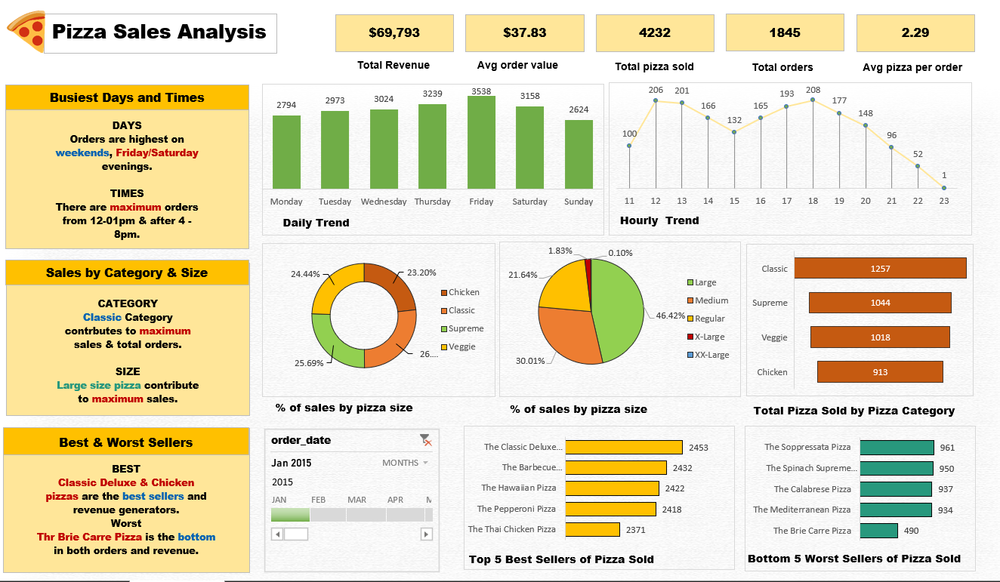

# Project Overview

*This project used Excel and SQL to analyze pizza sales data, calculating key metrics and developing visualizations to uncover trends and insights. It highlighted daily and hourly order patterns, sales distribution, and top-selling pizzas to enhance business performance.*

-------------------------------------------------------------------------------------------------------------------------------------------------
## Data and Exploration

### - Dataset  

 **`pizza sales analysis.xlsx`** 

### - Exploration Questions  
 
**The following questions are explored in this case study:**

- Total Revenue: What is the sum of the total price of all pizza orders?
- Average Order Value: What is the average amount spent per order?
- Total Pizzas Sold: What is the total number of pizzas sold?
- Total Orders: What is the total number of orders placed?
- Average Pizzas Per Order: What is the average number of pizzas sold per order?
- Daily Trend for Total Orders: What are the daily patterns or fluctuations in total orders?
- Hourly Trend for Total Orders: What are the peak hours or periods of high order activity?
- Percentage of Sales by Pizza Category: How are sales distributed across different pizza categories?
- Percentage of Sales by Pizza Size: What is the distribution of sales by different pizza sizes?
- Top 5 Best Sellers by Total Pizzas Sold: Which are the top 5 best-selling pizzas based on total sales?

-------------------------------------------------------------------------------------------------------------------------------------------------

